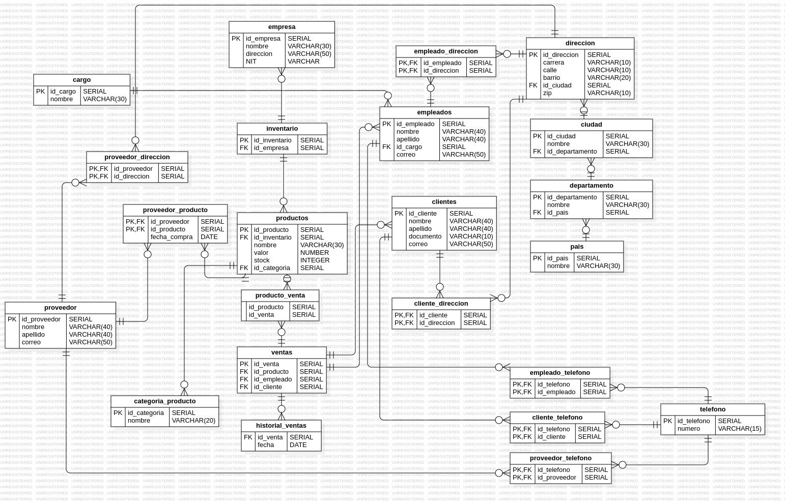

## Gestión de inventario para TechZone

El proyecto busca ayudar con la gestión de inventarios de la empresa TechZone, donde se crea una base de datos, se normaliza, se provee inserciones para probar, se toman en cuenta las necesidades del cliente y se usan para realizar la base de datos con Postgresql.



## Importar y ejecutar archivos SQL en PostgreSQL

```sql

--Comando para acceder a posgresql en campuslands

pgsql --host=localhost -U postgres
password = campus2023 

-- Ejecutar la base de datos

DROP DATABASE IF EXISTS techzone;
CREATE DATABASE techzone;
\c techzone;

```

## db.sql

En este archivo se crea la base de datos.

## inserts.sql 

En este archivo se crean las inserciones para utilizar en la base de datos y las consultas

## queries.sql

Este archivo contiene las consultas avanzadas.

## procedureandfunctions.sql

Estea archivo contiene los procedimientos y las funciones pedidas.

## Como ejecutar el procedimiento almacenado?

Para ejecutar el procedimiento almacenado, primero se hacen las inserciones del procedimiento almacenado, y luego las funciones.

Las funciones funcionan por separado y cumplen la funcion de que el procedimiento almacenado se ejecute correctamente.

codigo para probar el procedimiento almacenado luego de ejecutar todas las funciones:

```sql
CALL registrar_venta(1,1,1,3);
```